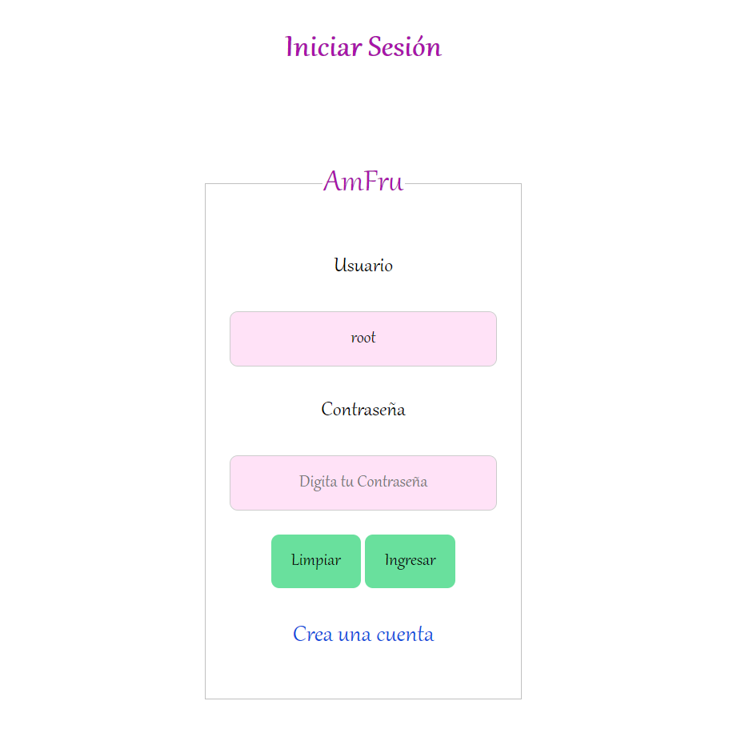
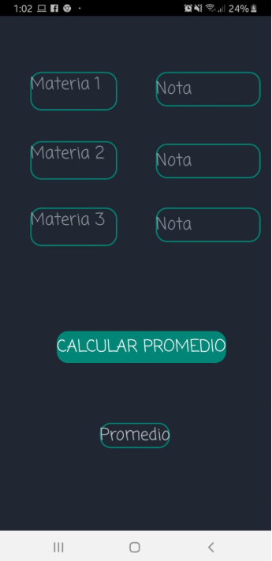

## Manuel Eduardo Albarrán
### Ingeniería de sistemas - Noveno semestre  

Algoritmos de ordenamiento:  
- ***Burbuja***: Funciona revisando cada elemento de la lista que va a ser ordenada con el siguiente, intercambiándolos de posición si están en el orden equivocado. Es necesario revisar varias veces toda la lista hasta que no se necesiten más intercambios, lo cual significa que la lista está ordenada.  
~~~
def burbuja_mayor(lista):
    for n in range(len(lista) - 1, 0, -1):
        for i in range(n):
            if lista[i] < lista[i + 1]:
                temp = lista[i]
                lista[i] = lista[i + 1]
                lista[i + 1] = temp

    mostrar_arreglo(lista)
def burbuja_menor(lista):
    for n in range(len(lista) - 1, 0, -1):
        for i in range(n):
            if lista[i] > lista[i + 1]:
                temp = lista[i]
                lista[i] = lista[i + 1]
                lista[i + 1] = temp

    mostrar_arreglo(lista)
def mostrar_arreglo(arrayN):
    for i in range(len(arrayN)):
        print('Elemento '+'-------> '+str(arrayN[i]))

def leer_arreglo():
    longitud = int(input("¿De que tamaña seria? "))
    arrayN = [0]*longitud
    index = 0
    for iten in arrayN:
        arrayN[index] = int(input("Digite el numero "+str(index)+" del arreglo: "))
        index = index + 1

    print("---------DESC------------------")
    burbuja_mayor(arrayN)
    print("---------ASC-------------------")
    burbuja_menor(arrayN)
    print("---------BURBUJA---------------")

leer_arreglo()
~~~ 

- ***Burbuja bidireccional***: El algoritmo de ordenamiento de burbuja bidireccional también llamado ordenamiento cocktail intenta mejorar el rendimiento del ordenamiento burbuja realizando el recorrido de comparación en ambas direcciones, de esta manera  se puede realizar más de un intercambio por iteración.
De la misma manera que el algoritmo de burbuja no se utiliza excepto para motivos pedagógicos por su falta de eficiencia pero sencillez de aplicación.  
~~~ 
def burbuja_direccional(arrayN):
    izq = 0
    der = len(arrayN)-1
    ultimo = len(arrayN)-1
    while True:
        entra = False
        for i in range(izq, der):
            if arrayN[i]>arrayN[i + 1]:
                aux = arrayN[i]
                arrayN[i] = arrayN[i + 1]
                arrayN[i + 1] = aux
                entra=True

        for k in range(der-1, izq-1,-1):
            if arrayN[k]>arrayN[k + 1]:
                aux = arrayN[k]
                arrayN[k] = arrayN[k + 1]
                arrayN[k + 1] = aux
                entra = True

        if (entra==False):
            break
    mostrar_arreglo(arrayN)

def burbuja_direccional_abajo(arrayN):
    izq = 0
    der = len(arrayN)-1
    ultimo = len(arrayN)-1
    while True:
        entra = False
        for i in range(izq, der):
            if arrayN[i]<arrayN[i + 1]:
                aux = arrayN[i]
                arrayN[i] = arrayN[i + 1]
                arrayN[i + 1] = aux
                entra=True

        for k in range(der-1, izq-1,-1):
            if arrayN[k]<arrayN[k + 1]:
                aux = arrayN[k]
                arrayN[k] = arrayN[k + 1]
                arrayN[k + 1] = aux
                entra = True

        if (entra==False):
            break
    mostrar_arreglo(arrayN)

def mostrar_arreglo(arrayN):
    for i in range(len(arrayN)):
        print('Elemento '+'-------> '+str(arrayN[i]))

def leer_arreglo():
    longitud = int(input("¿De que tamaña seria? "))
    arrayN = [0]*longitud
    index = 0
    for iten in arrayN:
        arrayN[index] = int(input("Digite el numero "+str(index)+" del arreglo: "))
        index = index + 1

    print("-----------------ASC----------------------------")
    burbuja_direccional(arrayN)
    print("-----------------DESC---------------------------")
    burbuja_direccional_abajo(arrayN)
    print("---------BURBUJA BIDIRECCIONAL------------------")
    
    
leer_arreglo()
~~~  

- ***Gnome sort***: El algoritmo empieza comparando la primera pareja de valores. Si están en orden incrementa el puntero y vuelve a realizar la comparación: si no están en orden, se pasa el menor a la izquierda y el mayor a la derecha, y se reduce el puntero. Ahora la comparación es con el elemento anterior, y si no hay un elemento anterior se pasa al siguiente elemento. Cuando el puntero alcanza el extremo superior del array, ya está totalmente ordenado.
Cuando compara hacia arriba va sin hacer intercambios, es que el par bajo examen está ordenado entre sí, y cuando compara hacia abajo, va haciendo intercambios. El proceso aparece como un zigzagueo continuo a un lado y otro.
La operación empieza por el puntero en el punto más bajo y cuando llega al extremo superior ha terminado de ordenar el array.  
~~~ 
def Gnome(lista):
	i=1
	while i<len(lista):
		if lista[i]<=lista[i-1]:
			i=i+1
		else:
			temp=lista[i-1]
			lista[i-1]=lista[i]
			lista[i]=temp
			if i>1:
				i=i-1

	mostrar_arreglo(lista)
def Gnome_abajo(lista):
	i=1
	while i<len(lista):
		if lista[i]>=lista[i-1]:
			i=i+1
		else:
			temp=lista[i-1]
			lista[i-1]=lista[i]
			lista[i]=temp
			if i>1:
				i=i-1

	mostrar_arreglo(lista)

def mostrar_arreglo(arrayN):
    for i in range(len(arrayN)):
        print('Elemento '+'-------> '+str(arrayN[i]))

def leer_arreglo():
    longitud = int(input("¿De que tamaña seria?"))
    arrayN = [0]*longitud
    index = 0
    for iten in arrayN:
        arrayN[index] = int(input("Digite el numero "+str(index)+" del arreglo: "))
        index = index + 1

    print("---------DESC------------------")
    Gnome(arrayN)
    print("---------ASC-------------------")
    Gnome_abajo(arrayN)
    print("---------GNOME-----------------")

leer_arreglo()
~~~  
- ***Insercion***: Ordenamiento por Inserción: Supóngase que se desea ordenar los siguientes claves del arreglo (A) utilizando el método de inserción directa el cual consiste en insertar un elemento del arreglo en la parte izquierda del mismo que ya se encuentra ordenada. Este proceso se repite desde el segundo hasta el n-esimo elemento.  
~~~ 
def ordenamientoPorInsercion_abajo(unaLista):
   for indice in range(1,len(unaLista)):

     valorActual = unaLista[indice]
     posicion = indice

     while posicion>0 and unaLista[posicion-1]<valorActual:
         unaLista[posicion]=unaLista[posicion-1]
         posicion = posicion-1

     unaLista[posicion]=valorActual
     mostrar_arreglo(unaLista)

def ordenamientoPorInsercion_arriba(unaLista):
   for indice in range(1,len(unaLista)):

     valorActual = unaLista[indice]
     posicion = indice

     while posicion>0 and unaLista[posicion-1]>valorActual:
         unaLista[posicion]=unaLista[posicion-1]
         posicion = posicion-1

     unaLista[posicion]=valorActual
     mostrar_arreglo(unaLista)

def mostrar_arreglo(arrayN):
    for i in range(len(arrayN)):
        print('Elemento '+'-------> '+str(arrayN[i]))

def leer_arreglo():
    longitud = int(input("¿De que tamaña seria?"))
    arrayN = [0]*longitud
    index = 0
    for iten in arrayN:
        arrayN[index] = int(input("Digite el numero "+str(index)+" del arreglo: "))
        index = index + 1

    print("---------DESC------------------")
    ordenamientoPorInsercion_abajo(arrayN)
    print("---------ASC-------------------")
    ordenamientoPorInsercion_arriba(arrayN)
    print("---------Insercion-------------")

leer_arreglo()
~~~  

- ***Peine sort***: La idea básica es eliminar las tortugas , o valores pequeños cerca del final de la lista, ya que en un ordenamiento de burbuja éstos lenta la clasificación tremendamente. Conejos , los valores grandes de todo el principio de la lista, no plantean un problema en el ordenamiento de burbuja.
En la ordenación de burbuja , cuando se comparan dos elementos cualesquiera, siempre tienen un hueco (distancia entre sí) de 1. La idea básica de peine tipo es que la brecha puede ser mucho mayor que 1. El bucle interior de ordenamiento de burbuja, la cual hace el real de intercambio , se modifica de tal manera que brecha entre elementos intercambiadas va hacia abajo (para cada iteración del bucle exterior) en pasos de un "reducir el factor" k : [ n / k , n / k 2 , n / k 3 , .. ., 1].
La brecha comienza como la longitud de la lista n siendo ordenadas divide por el factor de contracción k (generalmente 1,3; ver abajo) y una pasada de la mencionada especie de burbuja modificada se aplica con la brecha. A continuación, la brecha se divide por el factor de contracción de nuevo, la lista está ordenada con esta nueva brecha, y el proceso se repite hasta que la diferencia es 1. En este punto, peine tipo continúa usando un hueco de 1 hasta que la lista está totalmente ordenadas. La etapa final de la clase es por lo tanto equivalente a una especie de burbuja, pero en ese momento la mayoría de las tortugas se han tratado, por lo que un ordenamiento de burbuja será eficiente.  

~~~ 
def siGap(gap):
	gap=(gap*10)//13
	if gap<1:
		return 1
	return gap

def Peine(lista):
    n=len(lista)
    gap=n
    flag=True
    while(gap!=1 or flag==True):
            gap=siGap(gap)
            flag=False
            for i in range(0,n-gap):
                    if lista[i]>lista[i+gap]:
                            aux=lista[i]
                            lista[i]=lista[i+gap]
                            lista[i+gap]=aux

                            flag=True
    mostrar_arreglo(lista)

def mostrar_arreglo(arrayN):
    for i in range(len(arrayN)):
        print('Elemento '+'-------> '+str(arrayN[i]))

def leer_arreglo():
    longitud = int(input("¿De que tamaña seria? "))
    arrayN = [0]*longitud
    index = 0
    for iten in arrayN:
        arrayN[index] = int(input("Digite el numero "+str(index)+" del arreglo: "))
        index = index + 1

    Peine(arrayN)

leer_arreglo()
~~~  

- ***Quick sort***: En la práctica, es el algoritmo de ordenación más rápido conocido, su tiempo de ejecución promedio es O(n log (n)), siendo en el peor de los casos O(n2), caso altamente improbable. El hecho de que sea más rápido que otros algoritmos de ordenación con tiempo promedio de O(n log (n)) ( como SmoothSort o HeapSort ) viene dado por que QuickSort realiza menos operaciones ya que el método utilizado es el de partición.  

~~~ 
def quick_sort(lista):
    quick_sort_auxiliar(lista, 0, len(lista) - 1)

def quick_sort_auxiliar(lista, inicio, fin):
    if inicio < fin:
        punto_particion = particionar(lista, inicio, fin)

        quick_sort_auxiliar(lista, inicio, punto_particion - 1)
        quick_sort_auxiliar(lista, punto_particion + 1, fin)

def particionar(lista, inicio, fin):
    pivote = lista[inicio]

    izquierda = inicio + 1
    derecha = fin
    terminado = False

    while not terminado:
        while izquierda <= derecha and lista[izquierda] <= pivote:
            izquierda += 1

        while lista[derecha] >= pivote and derecha >= izquierda:
            derecha -= 1

        if derecha < izquierda:
            terminado = True
        else:
            lista[izquierda], lista[derecha] = lista[derecha], lista[izquierda]

    lista[inicio], lista[derecha] = lista[derecha], lista[inicio]

    return derecha

numeros = [7, 3, 2, 13, 5, 7, 11, 1]
print(numeros)

quick_sort(numeros)
print(numeros)
~~~  

- ***Shell sort***: El algoritmo Shell sort mejora el ordenamiento por inserción comparando elementos separados por un espacio de varias posiciones. Esto permite que un elemento haga "pasos más grandes" hacia su posición esperada. Los pasos múltiples sobre los datos se hacen con tamaños de espacio cada vez más pequeños. El último paso del Shell sort es un simple ordenamiento por inserción, pero para entonces, ya está garantizado que los datos del vector están casi ordenados.  
~~~ 
def shell(lista):
    mitad = len(lista) // 2

    while mitad > 0:
        for p in range(mitad):
            reducir(lista, p, mitad)

        mitad = mitad // 2

    mostrar_arreglo(lista)

def reducir(lista, inicio, salto):
    for i in range(inicio + salto, len(lista), salto):
        valor = lista[i]
        posicion = i

        while posicion >= salto and lista[posicion - salto] < valor:
            lista[posicion] = lista[posicion - salto]
            posicion = posicion - salto

        lista[posicion] = valor

def shell_inverso(lista):
    mitad = len(lista) // 2

    while mitad > 0:
        for p in range(mitad):
            reducir_inverso(lista, p, mitad)

        mitad = mitad // 2

    mostrar_arreglo(lista)

def reducir_inverso(lista, inicio, salto):
    for i in range(inicio + salto, len(lista), salto):
        valor = lista[i]
        posicion = i

        while posicion >= salto and lista[posicion - salto] > valor:
            lista[posicion] = lista[posicion - salto]
            posicion = posicion - salto

        lista[posicion] = valor

def mostrar_arreglo(arrayN):
    for i in range(len(arrayN)):
        print('Elemento '+'-------> '+str(arrayN[i]))

def leer_arreglo():
    longitud = int(input("¿De que tamaña seria?"))
    arrayN = [0]*longitud
    index = 0
    for iten in arrayN:
        arrayN[index] = int(input("Digite el numero "+str(index)+" del arreglo: "))
        index = index + 1

    print("-------------ASC--------------")
    shell_inverso(arrayN)
    print("-------------DESC-------------")
    shell(arrayN)
    print("-------------SHELL------------")

leer_arreglo()
~~~  

- ***Selección sort***: Consiste en encontrar el menor de todos los elementos del vector e intercambiarlo con el que está en la primera posición. Luego el segundo mas pequeño, y así sucesivamente hasta ordenarlo todo.  

~~~ 
def seleccion_arriba(lista):
    for indice in range(0, len(lista)):
        menor = lista[indice]
        posicion = indice
        for subindice in range(posicion, len(lista)):

            if lista[subindice] < menor:
                menor = lista[subindice]
                posicion = subindice

        if posicion != indice:
            temporal = lista[indice]
            lista[indice] = lista[posicion]
            lista[posicion] = temporal

    mostrar_arreglo(lista)

def seleccion_abajo(lista):
    for indice in range(0, len(lista)):
        menor = lista[indice]
        posicion = indice
        for subindice in range(posicion, len(lista)):

            if lista[subindice] > menor:
                menor = lista[subindice]
                posicion = subindice

        if posicion != indice:
            temporal = lista[indice]
            lista[indice] = lista[posicion]
            lista[posicion] = temporal

    mostrar_arreglo(lista)
def mostrar_arreglo(arrayN):
    for i in range(len(arrayN)):
        print('Elemento '+'-------> '+str(arrayN[i]))

def leer_arreglo():
    longitud = int(input("¿De que tamaña seria?"))
    arrayN = [0]*longitud
    index = 0
    for iten in arrayN:
        arrayN[index] = int(input("Digite el numero "+str(index)+" del arreglo: "))
        index = index + 1

    seleccion_arriba(arrayN)
    print("--------------------------")
    seleccion_abajo(arrayN)

leer_arreglo()
~~~  

Proyectos desarrollados:

- ***Aplicacion web (Conectada a base de datos)***

-***Aplicación en android (Conectada a base de datos)*** 

Certificados:  

-FULL STACK (FEDESOFT) 2018  

-CURSO EN JAVA (NO ME ACUERDO EL NOMBRE DE LA EMPRESA) 2016

